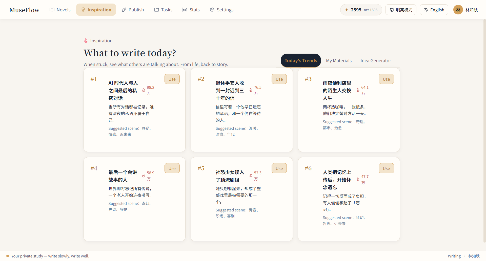

# 🚀 MuseFlow

> AI-Powered Novel Generation Platform · Full-Cycle Creative Tool from Inspiration to Publishing

<p align="center">
  <a href="README.md">English</a> · <a href="README.cn.md">中文</a>
</p>

[](https://golang.org)
[](https://vuejs.org)
[](https://kubernetes.io)
[](LICENSE)
[](CONTRIBUTING.md)

---

## 📖 Overview

**MuseFlow** is an intelligent novel generation platform built on a **Go microservices architecture**. It integrates **data crawling (Crawl4AI)**, **RAG-enhanced generation**, **asynchronous task scheduling**, and **multi-platform auto-publishing** into a complete content production pipeline: from market analysis → AI creation → channel distribution.

> Name Meaning: **Muse** (goddess of inspiration) + **Flow** = A continuous stream of creativity.

---

## ✨ Key Features

| Module | Feature | Description |
| :--- | :--- | :--- |
| 📦 **Project Management** | Novel CRUD & status transitions | Full lifecycle from draft to serialization to completion |
| 📚 **Lorebook** | Character/Worldbuilding/Plot management | Ensures consistency in AI-generated content |
| ✍️ **AI Generation** | Outline/Continuation/Rewriting/Expansion | RAG-enhanced generation with knowledge context |
| 🕷️ **Data Crawling** | Automatic novel/material scraping | Builds personal knowledge base with Crawl4AI |
| 📤 **Auto Publishing** | Scheduled publishing / Multi-platform | Supports Tomato Novel etc. (pluggable strategy) |
| 📊 **Analytics** | Writing stats / Character appearance analysis | Data-driven creative insights |

---

## 🖼️ Screenshots



---

## 🔗 Prototype Preview

The frontend prototype preview entry of MuseFlow. The API Gateway and backend
microservices (user-service, crawl4ai-service, etc.) are not yet wired in and will
be exposed as they become available:

> https://museflow.jfeng.asia

## 🧱 Architecture

The repository is a **Monorepo** — all code lives in a single Git repository. Microservices communicate via **gRPC**, and the **API Gateway** exposes unified HTTP endpoints to the outside world.

```
                ┌──────────────────────────┐
   Browser/Client │        API Gateway        │  (Gin, :5001)
   ─────HTTP────▶  /api/v1/* + Swagger       │
                │  JWT auth / CORS / Cookie  │
                └───────────┬──────────────┘
                            │ gRPC
                ┌───────────▼──────────────┐
                │       User Service        │  (gRPC, :5002)
                │  Register / Login / Dual   │
                │  Token Auth / User access  │
                │  (GORM)                    │
                └──────┬───────────┬────────┘
                       │           │
                  ┌────▼───┐  ┌────▼────┐
                  │Postgres│  │ Redis   │
                  │user_svc│  │ allow/deny list │
                  └────────┘  └─────────┘
```

### Backend modules implemented

| Path | Role | Stack | Port |
| :--- | :--- | :--- | :--- |
| `services/user-service` | User service (gRPC Server) | gRPC / GORM / PostgreSQL / Redis / JWT | 5002 |
| `services/api-gateway` | API Gateway (HTTP Server) | Gin / gRPC Client / JWT / Swagger | 5001 |
| `pkg/envloader` | Layered config loader | Go stdlib | — |
| `pkg/errcode` | Unified error codes & i18n responses | Go stdlib | — |
| `pkg/logger` | Structured logger (slog + lumberjack) | Go slog / lumberjack | — |
| `proto/user` | Shared gRPC contract (user.proto + generated code) | protobuf | — |
| `proto/crawl` | Shared gRPC contract for crawl/extract (crawl.proto + generated code) | protobuf | — |
| `services/crawl4ai-service` | Data-crawling service (Python, HTTP + gRPC dual interface) | Crawl4AI / FastAPI / gRPC | 5003 |
| `services/user-service/database/user_svc.sql` | User DB schema (sequences, triggers, schema namespace) | PostgreSQL DDL | — |

### Dual-Token Authentication (overview)

- **access token**: short-lived (default 1h), stateless JWT, returned in response body, sent via `Authorization` header
- **refresh token**: long-lived (default 30d), JWT + Redis allow-list, stored in an HttpOnly Cookie
- **logout**: remove refresh allow-list entry + write access token `jti` to Redis deny-list (TTL = remaining lifetime), auto-cleaned on expiry
- **device fingerprint**: `sha256(deviceId + User-Agent + IP)` to prevent cross-device refresh-token theft
- Full design: [`docs/en/develop/dual-token-auth.md`](docs/en/develop/dual-token-auth.md)

### Email verification & passwordless login (overview)

- **Register requires an email code**: before `Register`, call `SendVerifyCode` with `scene=register`, then submit the code; on success the account is marked `email_verified`.
- **Catch-up verify**: legacy unverified accounts can call `VerifyEmail` (`scene=verify`) to mark verified.
- **Passwordless login**: `LoginWithCode` (`scene=login`) issues dual tokens without a password; compatible with 2FA (returns `mfa_ticket` when enabled).
- Verification codes are scene-isolated in Redis with a resend cooldown.
- Per-module API docs: [`docs/en/api/`](docs/en/api/)

---

## 🗂️ Directory Structure

```
MuseFlow/
├── proto/                       # Shared gRPC API contracts (incl. generated code)
│   └── user/                    # user.proto + generated code (user.pb.go / user_grpc.pb.go)
├── pkg/                         # Cross-service shared Go libraries (independent go.mod)
│   ├── envloader/               # Layered .env loading (system > service .env > root .env > defaults)
│   ├── errcode/                 # Unified error codes & i18n (zh/en) responses
│   └── logger/                  # slog + lumberjack logger (with file rotation)
├── services/
│   ├── user-service/            # User service (Go, gRPC :5002)
│   │   ├── cmd/server/main.go    # gRPC entrypoint: wire config/repo/service/handler
│   │   ├── cmd/worker/main.go    # Async worker entrypoint: consumes the asynq queue
│   │   ├── .env.example          # Service config template (committed; .env gitignored)
│   │   └── internal/
│   │       ├── config/           # Config loading (USER_ / DB_ / REDIS_ / JWT_SECRET / LOG_)
│   │       ├── handler/          # gRPC handlers (proto ↔ service layer)
│   │       ├── pkg/              # Internal shared pkgs (email / queue)
│   │       ├── worker/handlers/  # asynq task handlers (delivery + progress)
│   │       ├── service/          # Business logic (split by domain into subpackages)
│   │       │   ├── auth/         #   Auth (register/login/refresh/logout/verify/email-code/2FA)
│   │       │   ├── token/        #   JWT management (manager / claims / fingerprint)
│   │       │   ├── task/         #   Async task progress lookup & subscription
│   │       │   ├── rbac/         #   Roles & permissions (Redis-cached)
│   │       │   ├── oauth/        #   Third-party account linking
│   │       │   ├── audit/        #   Operation audit persistence
│   │       │   └── dto/          #   Service-internal DTOs (Device / TokenPair)
│   │       ├── repository/       # Data access (GORM models + Redis token/code/task store)
│   │       ├── model/            # GORM entities (user_svc.users)
│   │       └── database/         # User DB DDL (user_svc.sql + migrations/)
│   ├── api-gateway/             # API Gateway (Go, HTTP :5001)
│   │   ├── .env.example          # Service config template (committed; .env gitignored)
│   │   └── internal/
│   │       ├── config/           # Config loading (GATEWAY_ / REDIS_ / JWT_SECRET / LOG_)
│   │       ├── router/           # Gin router wiring
│   │       ├── middleware/       # Middlewares (CORS / auth / access-log / request-id)
│   │       ├── handler/          # HTTP handlers (dto ↔ proto)
│   │       ├── client/           # user-service gRPC client
│   │       └── dto/              # HTTP-layer DTOs (request/response, for Swagger)
│   └── crawl4ai-service/        # Data-crawling service (Python, HTTP + gRPC :5003)
│       ├── src/                  # Business modules (crawler / extractor / api / grpc_server)
│       ├── pyproject.toml        # uv-managed deps (base + [http] / [grpc] groups)
│       ├── docker/               # Multi-stage Dockerfile + compose
│       └── README.md             # Service README (zh) + README.en.md (en)
├── deploy/                      # Deployment assets (K8s / Redis config, etc.)
├── docs/                        # Design docs (incl. dual-token auth design, api/)
├── web/                         # Frontend (Vue 3 + TypeScript + Vite)
├── scripts/                     # Codegen & helper scripts
├── .env                         # Global config (gitignored, holds dev defaults)
├── .env.example                 # Global config template (committed; copy to .env)
├── go.work                      # Go Workspace (local multi-module dev)
├── dev.bat / dev.sh             # One-shot hot-reload for all services (Windows / Linux·macOS)
├── Makefile                     # Root build script (Air hot-reload, proto gen, etc.)
├── README.md / README.cn.md
└── LICENSE
```

---

## 🚀 Quick Start

### Prerequisites

- Go 1.26+
- PostgreSQL 16+
- Redis 7+
- protoc + `protoc-gen-go` + `protoc-gen-go-grpc` (only when editing proto)
- swag (only to regenerate Swagger docs)

### 1. Initialize the workspace

```bash
make init        # generate go.work and install protoc-gen-go / swag tooling
```

### 2. Prepare database & cache

```bash
# Import the user DB schema (schema, sequences, triggers)
psql -h "$DB_HOST" -p "$DB_PORT" -U "$DB_USER" -d "$DB_NAME" -f services/user-service/database/user_svc.sql
```

> The server does **not** run AutoMigrate; the schema is managed solely by `services/user-service/database/user_svc.sql`.

### 3. Configure environment variables (layered)

Configuration is loaded **in layers**. Each service may place its own `.env` in its directory to override same-named keys from the root `.env`:

```
services/
├── user-service/
│   └── .env        # service-specific config (overrides global same-named vars)
└── api-gateway/
    └── .env
.env                # repo-root global config (default / shared values)
```

**Load priority (high → low):**

```
System env vars  >  service .env  >  repo-root .env  >  code defaults
```

| Prefix | Service | Key variables |
| :--- | :--- | :--- |
| `GATEWAY_` | api-gateway | `GATEWAY_PORT`, `GATEWAY_USER_SERVICE_URL`, `GATEWAY_ALLOW_ORIGINS`, `GATEWAY_COOKIE_*` |
| `USER_` | user-service | `USER_PORT`, `USER_ACCESS_TTL_SECONDS`, etc. |
| (none) | shared | `DB_HOST`, `DB_PORT`, `DB_USER`, `DB_PASSWORD`, `DB_NAME` (shared DB connection); `REDIS_ADDR`, `REDIS_PASSWORD`, `REDIS_DB` (shared Redis); `JWT_SECRET` (shared JWT signing key for gateway + user-service) |
| `LOG_` | all services | `LOG_LEVEL`, `LOG_FORMAT`, `LOG_OUTPUT_PATH`, `LOG_CONSOLE`, etc. |

`.env` / `services/*/.env` are gitignored (they may contain real secrets). The repo ships `.env.example` and `services/user-service/.env.example` as templates — copy to `.env` locally and edit as needed:

```bash
cp .env.example .env                              # global
cp services/user-service/.env.example services/user-service/.env   # service-specific
```

To override a single key, set a system env var (highest priority), e.g.:
```bash
set JWT_SECRET=your-strong-secret      # Windows
# export JWT_SECRET=your-strong-secret  # Linux/macOS
```

> Each service only reads its own prefixed variables. Priority: **system env > `.env` file > code defaults**.

### 4. Run locally

```bash
# Terminal A: user service
make run-user

# Terminal B: API gateway
make run-gateway
```

After startup, the console prints the access and Swagger URLs:

- API Gateway: http://localhost:5001
- Swagger docs: http://localhost:5001/swagger/index.html
- User service (gRPC): localhost:5002

### 5. Common commands

```bash
make build       # build all services into bin/ (incl. user-service worker)
make test        # run tests
make vet         # static analysis
make proto       # regenerate gRPC code
make swagger     # regenerate Swagger docs
make watch       # Air hot-reload the whole backend (same as ./dev.sh)
make docker      # build Docker images (context = repo root)
```

> **Windows users (no make):** equivalent batch scripts are provided — run directly in PowerShell/CMD:
>
> | Script | Equivalent | Notes |
> | :--- | :--- | :--- |
> | `scripts\run-user.bat` | `make run-user` | start user-service |
> | `scripts\run-gateway.bat` | `make run-gateway` | start api-gateway |
> | `scripts\watch-user.bat` | `make watch-user` | Air hot-reload user-service |
> | `scripts\watch-gateway.bat` | `make watch-gateway` | Air hot-reload api-gateway |
> | `dev.bat` | `make watch` | **recommended**: hot-reload the whole backend (gateway + user-service + worker); can be double-clicked |
> | `dev.bat gateway` | `make watch-gateway` | api-gateway only |
> | `dev.bat user` | `make watch-user` | user-service only (gRPC) |
> | `dev.bat worker` | `make watch-user-worker` | user-service worker only (asynq consumer) |
> | `dev.bat web` | — | frontend only (`pnpm dev`) |
> | `dev.bat full` | `make watch-full` | whole backend + frontend |
> | `dev.bat help` | — | show usage |
>
> `dev.bat` lives at the repo root; each service gets its own window, and closing a window stops that service.
> The `scripts\*.bat` granular entry points remain available.
>
> Install Air first: `go install github.com/air-verse/air@latest` (scripts auto-add `%USERPROFILE%\go\bin` to PATH). Chinese console output in old CMD code pages may render garbled, but functionality is unaffected.
> **Note**: `*.bat` files in this repo must keep CRLF line endings — LF makes cmd.exe truncate lines and garble output.

---

## 📡 API Reference

Per-module docs (with detailed routes and fields) live under [`docs/en/api/`](docs/en/api/):

- **[user-service](docs/en/api/user-service.md)** — core user & auth service (gRPC `:5002`): accounts, dual tokens, email codes, 2FA, RBAC, audit, OAuth.
- **[api-gateway](docs/en/api/api-gateway.md)** — unified HTTP entry (`:5001`): full route table, auth/error mapping, CORS & Cookie policy.
- **[crawl4ai-service](docs/en/api/crawl4ai-service.md)** — data crawling (`:5003`): `Health` / `Crawl` / `Extract` (HTTP + gRPC).

Each service also ships Swagger (gateway at `/swagger/index.html`, crawl4ai-service at `/docs`).

---

## 📦 Containerization

`services/api-gateway/Dockerfile` and `services/user-service/Dockerfile` are multi-stage builds using `golang:1.23-alpine` to compile and `alpine:3.20` to run, launched as a non-root user.

```bash
docker build -f services/user-service/Dockerfile -t museflow/user-service .
docker build -f services/api-gateway/Dockerfile  -t museflow/api-gateway  .
```

The build context must be the **repo root** (services depend on the sibling `proto` module).

---

## 📄 License

[MIT License](LICENSE)

---

## 📧 Contact

- Author: [jfeng2048]
- Email: [jfeng2048@outlook.com]
- Project Link: [https://github.com/JFeng2048/museflow](https://github.com/JFeng2048/museflow)

---

**If you find this project helpful, please ⭐ Star it!**
