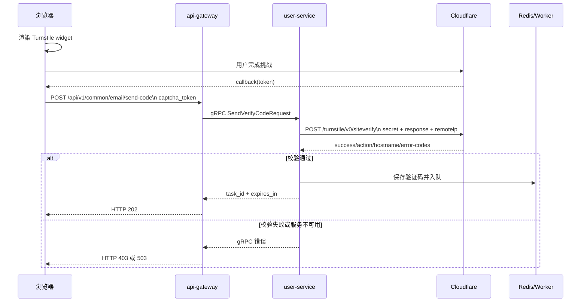

# 人机认证实现文档

## 目标与边界

MuseFlow 使用 Cloudflare Turnstile 保护发送邮箱验证码等容易被自动化刷取的接口。认证采用双密钥模型：

- 前端只使用 Site Key，在浏览器中渲染 Turnstile widget。
- 后端只保存 Secret Key，并调用 Cloudflare Siteverify API。
- 前端 token 是一次性的，前端拿到 token 不代表认证成功，必须由后端验证 `success=true`。

未配置 `USER_TURNSTILE_SECRET` 时，user-service 会跳过校验并输出告警，仅适合本地开发。生产环境必须配置 Secret Key。

## 完整请求链路



## 前端实现

组件位于 `web/src/components/auth/TurnstileWidget.vue`。

1. `useTurnstileScript` 加载 Cloudflare 脚本。
2. 组件使用 `VITE_TURNSTILE_SITE_KEY` 渲染 widget。
3. `action` 由业务场景传入，例如登录发送验证码使用 `login`，注册使用 `register`。
4. widget 的 callback 产生 token，并通过 `update:token` 暴露给业务页面。
5. 发送验证码前调用 `ensureToken()`；没有 token 时显示 widget 并等待 callback。
6. token 写入 `captcha_token`，随 `/common/email/send-code` 请求发送。
7. token 过期或验证失败后必须重新生成，不能缓存并重试同一个 token。

请求示例：

```json
{
  "email": "user@example.com",
  "scene": "login",
  "captcha_token": "<one-time-token>"
}
```

`web/src/api/system/auth/index.ts` 对发送验证码请求使用 60 秒超时，因为后端需要访问外部 Cloudflare 服务；其它 API 仍使用全局默认超时。

## 网关与 user-service

api-gateway 的 `CommonHandler.SendVerifyCode` 将 JSON 字段转换为 gRPC：

- `email` -> `Email`
- `scene` -> `Scene`
- `captcha_token` -> `CaptchaToken`
- `c.Request.Context()` 的客户端 IP -> `ClientIp`

user-service 的 `AuthService.SendVerifyCode` 在生成验证码、占用重发冷却和入队之前调用验证码校验。校验失败不会生成验证码，也不会占用重发冷却。

校验器位于 `services/user-service/internal/pkg/turnstile/turnstile.go`，使用表单编码请求：

```text
POST https://challenges.cloudflare.com/turnstile/v0/siteverify
Content-Type: application/x-www-form-urlencoded

secret=<Secret Key>&response=<token>&remoteip=<public IP>
```

本地回环地址、私网地址和无法解析为公网地址的值不会提交 `remoteip`。

## 响应校验规则

后端按以下顺序处理 Cloudflare 响应：

1. 网络错误、TLS 错误、超时、上下文取消或无法解析 JSON：返回 `ErrServiceUnavailable`，fail-closed。
2. `success=false`：
   - `invalid-input-secret` / `missing-input-secret`：按服务不可用处理，检查 Secret Key。
   - `invalid-input-response`、`timeout-or-duplicate`、`missing-input-response`、`bad-request`：按 token 无效处理。
3. HTTP 状态不是 200：返回服务不可用。
4. 配置了期望 action 且 Cloudflare 返回 action 不为空时，必须完全匹配。
5. 配置了 `USER_TURNSTILE_ALLOWED_HOSTNAMES` 时，hostname 必须在白名单内；匹配忽略大小写和末尾点。

错误映射：

- token 缺失、无效、action 不匹配、hostname 不匹配 -> gRPC `PermissionDenied`，网关返回 HTTP 403。
- Cloudflare 网络故障、HTTP 异常或 Secret 无效 -> gRPC `Unavailable`，网关返回 HTTP 503。

## 配置

user-service 使用 `envloader` 读取配置。服务 `.env` 中的变量名带 `USER_` 前缀，传入 Turnstile 配置时去除此前缀：

```dotenv
USER_TURNSTILE_SECRET=0x...
USER_TURNSTILE_ENDPOINT=https://challenges.cloudflare.com/turnstile/v0/siteverify
USER_TURNSTILE_TIMEOUT_SECONDS=40
USER_TURNSTILE_ALLOWED_HOSTNAMES=museflow.jfeng.asia,localhost,127.0.0.1
```

优先级为系统环境变量 > 服务 `.env` > 仓库根 `.env` > 默认值。Secret Key 只能放在后端环境中，不能放入 `VITE_*` 前端变量、日志、请求响应或仓库提交。

发送验证码链路的超时必须大于 Turnstile 超时：

- 前端 `sendCode`：60 秒。
- api-gateway HTTP `ReadTimeout` / `WriteTimeout`：60 秒。
- user-service Turnstile：由 `USER_TURNSTILE_TIMEOUT_SECONDS` 控制，建议小于 60 秒。

如果上游请求在 Cloudflare 返回前被取消，Go 会记录 `context canceled`。这通常表示前端、网关或反向代理超时小于 Turnstile 校验超时，而不是 Cloudflare 返回了无效结果。

## 本地诊断

从浏览器开发者工具中复制刚刚生成的 `captcha_token`，每次测试都必须重新完成 widget。不要重复使用旧 token。

在 `services/user-service` 目录执行：

```powershell
$env:USER_TURNSTILE_SECRET = "<Secret Key>"
.\scripts\test-turnstile.ps1 -Token "<fresh-token>" -Action "login"
```

脚本会使用与后端相同的表单请求，并输出 `success`、HTTP 状态、action、hostname、错误码和耗时；不会输出 Secret 或完整 token。需要代理时：

```powershell
.\scripts\test-turnstile.ps1 -Token "<fresh-token>" -Action "login" -Proxy "http://127.0.0.1:7890"
```

PowerShell 禁止执行脚本时，可对当前用户设置：

```powershell
Set-ExecutionPolicy -Scope CurrentUser RemoteSigned
```

也可以先检查代理和 DNS：

```powershell
Get-ChildItem Env:HTTP_PROXY,Env:HTTPS_PROXY,Env:ALL_PROXY,Env:NO_PROXY -ErrorAction SilentlyContinue
netsh winhttp show proxy
Resolve-DnsName challenges.cloudflare.com
```

## 测试与发布检查

```powershell
cd services/user-service
go test ./internal/pkg/turnstile -v
go test ./...
go vet ./...

cd ../../services/api-gateway
go test ./...

cd ../../web
pnpm.cmd build
```

单元测试使用本地 fake siteverify 服务验证请求方法、表单字段、错误映射、action、hostname、超时和上下文取消。它们不能伪造一个真实可被 Cloudflare 接受的 token；真实链路测试必须使用浏览器生成的新 token，并通过诊断脚本或前端发送验证码接口验证。

## 安全注意事项

- Secret Key 已泄露或进入日志、聊天记录时，必须在 Cloudflare 控制台立即轮换。
- 不要把 Secret Key 写入前端、Swagger 示例、测试 token 或提交记录。
- 不要为了恢复可用性在生产环境清空 Secret；这会关闭人机防护。
- token 是一次性的，失败重试必须重新拉起 widget。
- 校验服务不可用时保持拒绝，避免 Cloudflare 故障导致接口裸奔。