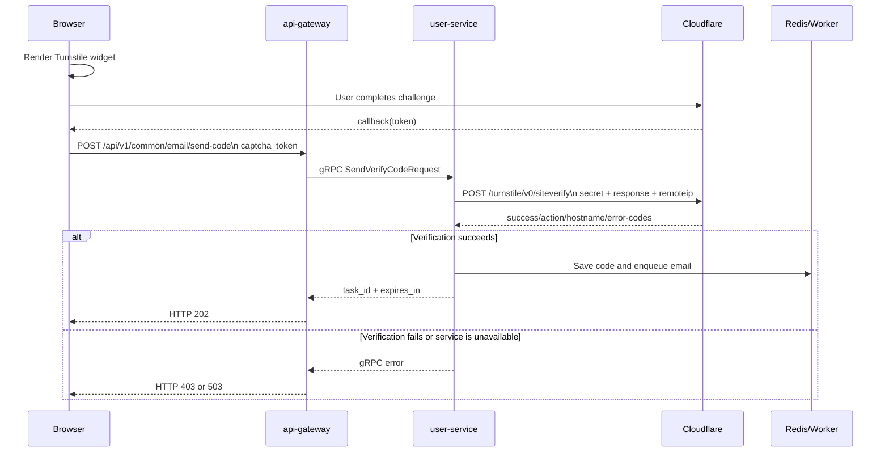

# Turnstile Human Verification Implementation

## Goals and boundaries

MuseFlow uses Cloudflare Turnstile to protect endpoints such as email verification-code delivery that are easy to abuse through automation. It uses a two-key model:

- The frontend uses only the Site Key to render the Turnstile widget in the browser.
- The backend stores the Secret Key and calls Cloudflare Siteverify.
- A frontend token is single-use. Receiving a token in the browser does not mean verification succeeded; the backend must receive `success=true` from Siteverify.

When `USER_TURNSTILE_SECRET` is empty, user-service skips verification and logs a warning. This fallback is for local development only. Production must configure a Secret Key.

## End-to-end request flow



## Frontend implementation

The component is `web/src/components/auth/TurnstileWidget.vue`.

1. `useTurnstileScript` loads the Cloudflare script.
2. The widget is rendered with `VITE_TURNSTILE_SITE_KEY`.
3. The caller supplies an `action`, such as `login` or `register`.
4. The widget callback produces a token and exposes it through `update:token`.
5. Before sending a verification code, the page calls `ensureToken()`. If no token exists, the widget is shown and the call waits for the callback.
6. The token is sent as `captcha_token` to `/common/email/send-code`.
7. An expired or rejected token must be replaced with a newly generated token. The old token must not be retried.

Example request:

```json
{
  "email": "user@example.com",
  "scene": "login",
  "captcha_token": "<one-time-token>"
}
```

`web/src/api/system/auth/index.ts` uses a 60-second timeout for the send-code request because the backend calls an external Cloudflare service. Other APIs keep the global default timeout.

## Gateway and user-service

`CommonHandler.SendVerifyCode` in api-gateway maps the JSON request to gRPC:

- `email` -> `Email`
- `scene` -> `Scene`
- `captcha_token` -> `CaptchaToken`
- `c.Request.Context()` client IP -> `ClientIp`

`AuthService.SendVerifyCode` in user-service verifies the token before generating a code, acquiring the resend lock, or enqueueing an email. Failed verification therefore neither creates a code nor consumes the resend cooldown.

The verifier is implemented in `services/user-service/internal/pkg/turnstile/turnstile.go`. It sends form-encoded data:

```text
POST https://challenges.cloudflare.com/turnstile/v0/siteverify
Content-Type: application/x-www-form-urlencoded

secret=<Secret Key>&response=<token>&remoteip=<public IP>
```

Loopback, private, and otherwise non-public client addresses are omitted from `remoteip`.

## Response validation rules

The backend handles the Cloudflare response in this order:

1. Network errors, TLS errors, timeouts, context cancellation, and invalid JSON return `ErrServiceUnavailable` using a fail-closed policy.
2. For `success=false`:
   - `invalid-input-secret` / `missing-input-secret` are treated as service unavailability; check the Secret Key.
   - `invalid-input-response`, `timeout-or-duplicate`, `missing-input-response`, and `bad-request` are treated as an invalid token.
3. A non-200 HTTP status returns service unavailability.
4. When an expected action is configured and Cloudflare returns a non-empty action, it must match exactly.
5. When `USER_TURNSTILE_ALLOWED_HOSTNAMES` is configured, the response hostname must be on the allowlist. Matching ignores case and a trailing dot.

Error mapping:

- Missing or invalid token, action mismatch, and hostname mismatch -> gRPC `PermissionDenied`, exposed by the gateway as HTTP 403.
- Cloudflare network failure, abnormal HTTP response, or invalid Secret Key -> gRPC `Unavailable`, exposed by the gateway as HTTP 503.

## Configuration

user-service reads configuration through `envloader`. Variables in the service `.env` use the `USER_` prefix and are passed to the Turnstile configuration without that prefix:

```dotenv
USER_TURNSTILE_SECRET=0x...
USER_TURNSTILE_ENDPOINT=https://challenges.cloudflare.com/turnstile/v0/siteverify
USER_TURNSTILE_TIMEOUT_SECONDS=40
USER_TURNSTILE_ALLOWED_HOSTNAMES=museflow.jfeng.asia,localhost,127.0.0.1
```

The precedence is system environment > service `.env` > repository root `.env` > defaults. The Secret Key must remain backend-only; never put it in a `VITE_*` variable, logs, responses, or source control.

The send-code request path must allow more time than the Turnstile timeout:

- Frontend `sendCode`: 60 seconds.
- api-gateway HTTP `ReadTimeout` / `WriteTimeout`: 60 seconds.
- user-service Turnstile: controlled by `USER_TURNSTILE_TIMEOUT_SECONDS`, recommended below 60 seconds.

If the upstream request is canceled before Cloudflare responds, Go logs `context canceled`. This normally means the frontend, gateway, or reverse proxy timeout is shorter than the Turnstile timeout; it is not a Cloudflare invalid-token response.

## Local diagnostics

Copy the freshly generated `captcha_token` from the browser developer tools. Every attempt must use a newly completed widget because tokens are single-use.

From `services/user-service`, run:

```powershell
$env:USER_TURNSTILE_SECRET = "<Secret Key>"
.\scripts\test-turnstile.ps1 -Token "<fresh-token>" -Action "login"
```

The script uses the same form request as the backend and prints `success`, HTTP status, action, hostname, error codes, and elapsed time without printing the Secret or full token. To use a proxy:

```powershell
.\scripts\test-turnstile.ps1 -Token "<fresh-token>" -Action "login" -Proxy "http://127.0.0.1:7890"
```

If PowerShell blocks local scripts:

```powershell
Set-ExecutionPolicy -Scope CurrentUser RemoteSigned
```

Proxy and DNS checks:

```powershell
Get-ChildItem Env:HTTP_PROXY,Env:HTTPS_PROXY,Env:ALL_PROXY,Env:NO_PROXY -ErrorAction SilentlyContinue
netsh winhttp show proxy
Resolve-DnsName challenges.cloudflare.com
```

## Tests and release checks

```powershell
cd services/user-service
go test ./internal/pkg/turnstile -v
go test ./...
go vet ./...

cd ../../services/api-gateway
go test ./...

cd ../../web
pnpm.cmd build
```

Unit tests use a local fake Siteverify server to verify the request method, form fields, error mapping, action, hostname, timeout, and context cancellation. They cannot manufacture a real token accepted by Cloudflare; an end-to-end check must use a fresh browser token and the diagnostic script or the frontend send-code request.

## Security notes

- Rotate the Secret Key immediately if it appears in logs, chat history, or source control.
- Never put the Secret Key in frontend code, Swagger examples, test tokens, or commit messages.
- Do not clear the Secret in production to restore availability; that disables human verification.
- Tokens are single-use; retries require a new widget token.
- Keep the fail-closed behavior when Cloudflare is unavailable so an outage does not disable abuse protection.